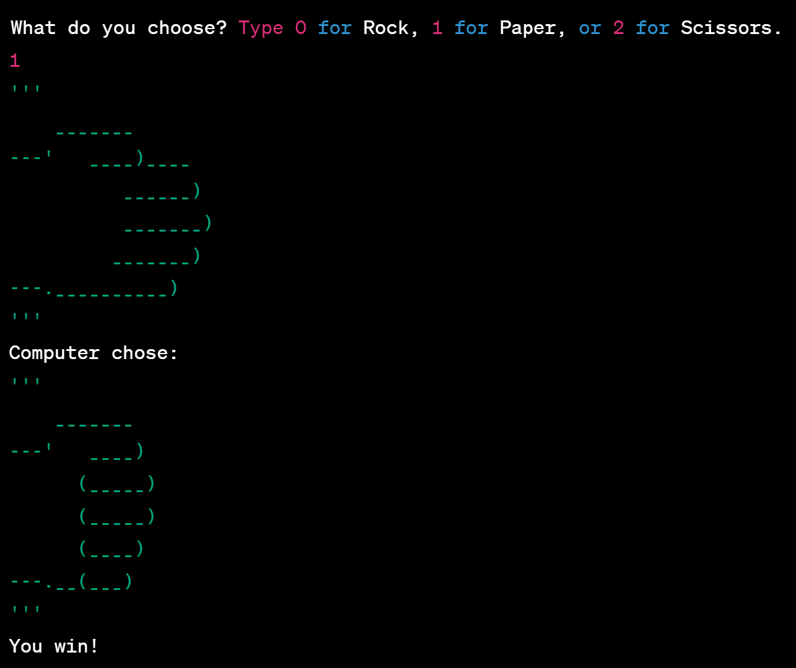

# Rock, Paper, Scissors Console Game

## Introduction

This is a simple Python program that allows users to play the classic game of Rock, Paper, Scissors against the computer. The program generates a random choice for the computer and compares it with the user's input to determine the winner.

## Usage

- Run the program in a Python environment.
- Enter your choice:
  - Type 0 for Rock
  - Type 1 for Paper
  - Type 2 for Scissors

  ## Rules

  The rules of the game are as follows:

  - Rock Beats Scissors
  - Scissors Beats Paper
  - Paper covers Rock

  The program will display the choices made by both the user and the computer, and then announce the winner or declare a draw based on the game rules.

  ## Example

